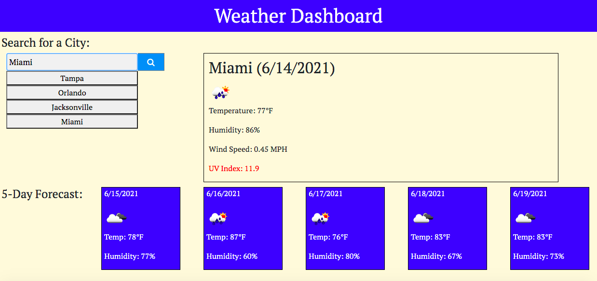

# weather_dashboard
Welcome to my Weather Dashboard!  This dashboard was created using OpenWeather API (https://openweathermap.org/api) and runs in the browser.  The application allows the user to search any city of their choice.  The application will save the city in local storage and on the page itself under the search box so the user can see what cities they have searched.  The result of the search will feature the current weather by displaying the temperature in farenheit, humidity percentage, and wind speed. The UV index also appears in various colors depending on the severity for that day.  At the bottom of the page the user will find the forecast for the following five days which will give the date, temperature in farenheit, and humidity percentage.  Weather icons are also included. This app is responsive and features dynamically updated HTML and CSS.

Screenshot: 

Deployed: https://caseofbase18.github.io/weather_dashboard/